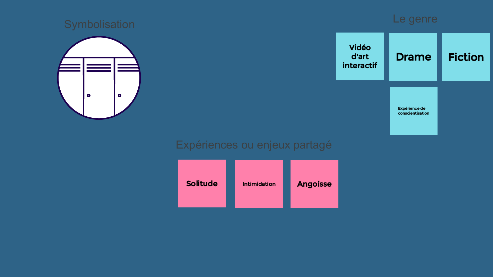
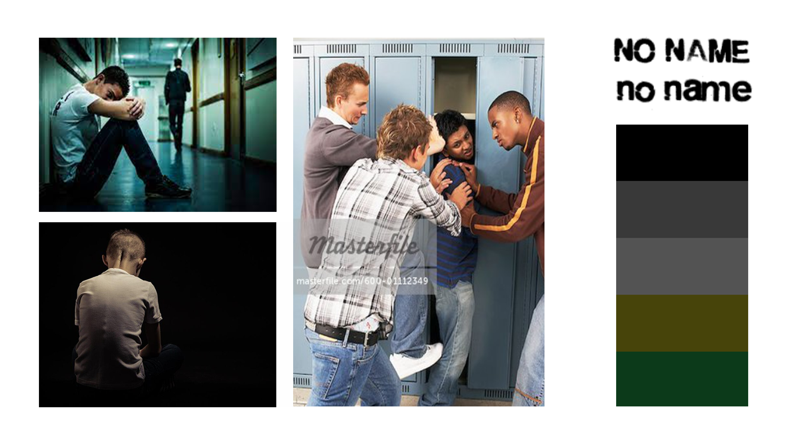
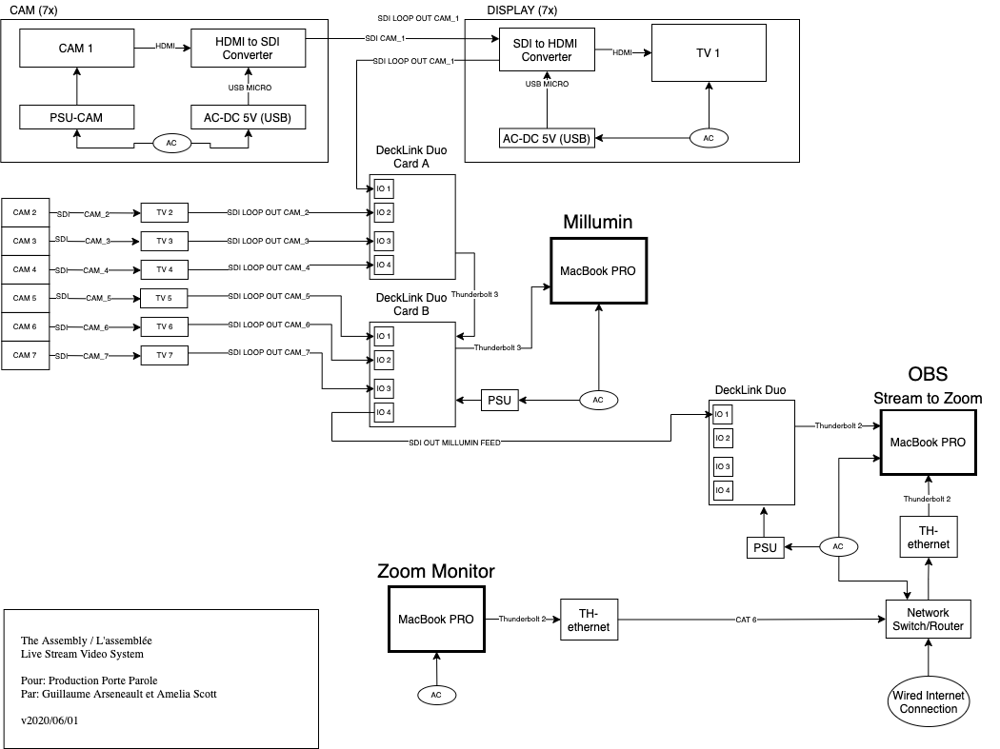

# Préproduction
> C'est ici qu'on dépose les éléments de la préproduction.

# Table des matières
1. [Intention ou concept](#Intention-ou-concept)
    - [Cartographie](#Cartographie)
    - [Intention de départ](#Intention-de-départ)
    - [Synopsis](#Synopsis)
    - [Tableau d'ambiance (*moodboard*)](#Tableau-d'ambiance-(*moodboard*))
    - [Scénario, scénarimage ou document audio/visuel](#Scénario,-scénarimage-ou-document-audio/visuel)
2. [Planification technique d'un prototype (devis technique)](#Planification-technique-(devis-technique))
    - [Schémas ou plans techniques](#Schémas-ou-plans-techniques)
    - [Matériaux requis](#Matériaux-de-scénographie-requis)
    - [Équipements requis](#Équipements-requis)
    - [Logiciels requis](#Logiciels-requis)
    - [Ressources humaines requises](#Ressources-humaines-requises)
    - [Ressources spatiales requises (rangement et locaux)](#Ressources-spatiales-requises-(rangement-et-locaux))
    - [Contraintes techniques et potentiels problèmes de production](#Contraintes-techniques-et-potentiels-problèmes-de-production)
3. [Planification de la production d'un prototype (budget et étapes de réalisation)](#Planification-de-la-production-(budget-et-étapes-de-réalisation))
    - [Budget prévisionnel](#Budget-prévisionnel)
    - [Échéancier global](#Échéancier-global)
    - [Liste des tâches à réaliser](#Liste-des-tâches-à-réaliser)
    - [Rôles et responsabilités des membres de l'équipe](#Rôles-et-responsabilités-des-membres-de-l'équipe))
    - [Moments des rencontres d'équipe](#Moments-des-rencontres-d'équipe)

# Intention ou concept
## Cartographie
> Exemples:

## Intention de départ
Immersion dans la peau d’une personne d’un enfant non intimidé jouant dans la cour de récréation vs dans la peau d’un enfant intimidé et enfermé dans un casier. 
Ce projet, fait vivre a l'utilisateur un sentiments d'impuissance et détresse. Ce qui as pour but de faire comprendre l'importance de ne pas laisser une personne seul dans ce genre de situation. Ainsi, l'utilisateur resent de l'empathie a l'égard des personnes intimidés.

## Synopsis
Tu es enfermé dans un casier sombre et glacial pour la 89 ème fois cette année le temps te paraît une éternité des rires moqueurs, ta respiration devient de plus en plus insupportable, l'angoisse commence à prendre le dessus 5 minutes devient un long moment interminable.

Tu es dans la cour de récréation ou tu t'amuses a jouer a plusieurs jeux différents le temps passe trop rapidement.

## Tableau d'ambiance (*moodboard*)

## Scénario, scénarimage ou document audio/visuel
L’utilisateur entre dans la salle, il ouvre la porte et tombe sur casque vr reposant sur un piédestal. En mettant le casque vr un jeu de ballon chasseur apparaît.
 

Dans ce jeu tu as un nombre infini de ballons pour toucher les cibles, il faut toucher le plus de cible possible dans le temps impartie de 3 minutes selon le résultat une animation apparaît avec le score.
 

Dans tous les cas, l'utilisateur est invité à franchir la porte pour poursuivre l'expérience.
 

L’utilisateur sera enfermé dans un casier pour une durée de 3 minutes. Dans le noir, il y aurait des respirations fortes, des rires moqueurs et des bruits de métals. Le tout pour rendre mal à l' aise l’utilisateur afin d’avoir une expérience plus immersive.
 

À la fin de l'expérience, une voix explique que la deuxième expérience vous met dans la peau d’une victime d'intimidation coincée dans un casier. Elle explique que même si les deux expériences ont duré le même temps, mentallement le temps semblait plus lent dans le deuxième.

# Planification technique d'un prototype (devis technique)
## Schémas ou plans techniques
> Insérer plans, documents et schémas pertinents dans cette sectio.  

### Plantation 

### Schéma de branchement 

## Matériel de scénographie requis

> Liste des matériaux de scénographie (matériaux de décor) requis ou lien vers un tableur Excel ou document Markdown à part si nécessaire (quantité, spécifications techniques, lien vers fiche technique si applicable, commentaires...)

* Faux Casier crée en coroplaste, carton renforcé, 2 hauts-parleurs et une chaise.
* Rideau noir 
* Fausse porte 

## Équipements requis
> Liste des équipements requis par département ou lien vers un tableur Excel ou document Markdown à part si nécessaire (quantité, spécifications techniques, lien vers fiche technique si applicable, commentaires...)

* Audio
    * 8 haut-parleurs actifs de 4"
    * 8 fils XLR 3 conducteurs de 15' (M->F)
    * Interface audio USB disposant 8 sorties 

* Vidéo
    * 2 projecteurs vidéo lentille standard
    * 2 système d'acrochage
    * 3 webcam logitech c920

* Lumière
    * 4 lumière LED RGBAW DMX
    * 4 fils XLR 3 conducteurs de 20'
    * Console DMX
    * Interface DMX USB

* Électricité
    * 8 cordon IEC (pour l'alimentation des haut-parleurs)
    * 2 extentions 3 fiches et 3 conducteurs 
    * 2 multiprise

* Réseau
    * 4 fils cat6a de 15"
    * Switch poe 5 ports

* Ordinateur
    * 1 ordinateur portable 
    
* Autre
    * Tout autre élément pertinant

## Logiciels requis
> Liste des logiciels requis, version ainsi que leurs dépendences

* [nodeJS 14.15.4 LTS](https://nodejs.org/en/) 
    * [node-osc](https://github.com/MylesBorins/node-osc)
* [Max 8](https://cycling74.com/products/max)   
* [Unity 2019 lts](https://unity.com/)
* [Open stage control](https://openstagecontrol.ammd.net/)

## Ressources humaines requises
> Formaté en liste ou en lien vers un tableur Excel.

* TTP, location de matériel
* Voix féminine ou Masculine (ADOLESCENT)

## Ressources spatiales requises (rangement et locaux)
> Spécifications des espaces nécessaires formaté en liste ou lien vers un tableur Excel.

* Grand studio
    * Grand studio divisé en deux (casier d'un côté et jeu dans l'autre)

* Petit studio
    * Enregistrement audio

## Contraintes techniques et potentiels problèmes de production
> Tableau ou lien vers un tableur Excel (contraintes, problème et solution envisagée, commentaires...)

| Contrainte ou problème potentiel                 | Solution envisagée                                    | Commentaires                                                                                 |
|--------------------------------------------------|-------------------------------------------------------|----------------------------------------------------------------------------------------------|
| Création du casier, instalation lumière et son (synchronisé) |Se renseigner pour la confection du casier a une créatrice de scène de théatre, Formation avec TTP, expérimentation durant la session |Avec les ressources nécéssaires nous sommes confiant que la réalisation de notre projet sera un succès. |
|                                                  |                                                       |                                                                                              |

# Planification de la production d'un prototype (budget et étapes de réalisation)
## Budget prévisionnel

[Lien vers document](https://cmontmorency365.sharepoint.com/:x:/s/TIM-58266B-Expriencemultimdiainteractive-Enseignants/ERS3zx4iKAlLn03N_0h3cyQBOV_nxNuKvrKnqmrXGcgDYg?e=Rjq9Uc)

## Échéancier global
Étapes importantes du projet visualisé dans GitHub (*milestones*):  
https://github.com/tim-montmorency/66B-modele_de_projet/milestones

*Dates importantes :*
- Première itération : lundi x novembre
- Prototype finale : lundi x décembre
- Présentation des projets devant public : jeudi 25 mars (soir)

## Liste des tâches à réaliser
Visualisation des tâches à réaliser dans GitHub selon la méthode Kanban:  
https://github.com/tim-montmorency/66B-modele_de_projet/projects/2?add_cards_query=is%3Aopen

Inventaire des tâches à réaliser dans GitHub selon le répertoire d'*issues*:  
https://github.com/tim-montmorency/66B-modele_de_projet/issues

## Rôles et responsabilités des membres de l'équipe
> Il vous est proposé ici de nommer une personne à la coordination générale du projet, à la coordination technique et à la coordination artistique. Les grandes décisions sur les grandes orientations du projet devraient se prendre en groupe lors de rencontres d'équipe. Cependant, les décisions entre vos rencontres de groupe devraient appartenir à ces personnes.

**Étudiant E**
- Coordination générale du projet (coordination de l'échéancier, du budget, suivi de la liste des tâches à réaliser, s'assurer de la répartition du rôle et des responsabilités des membres de l'équipe);
- Création du module d'interprétation des données;
- Programmation du module Max de contrôle vidéo.

Liste des tâches dans Git Hub:  
https://github.com/tim-montmorency/66B-modele_de_projet/issues/assigned/DarylMomo  
https://github.com/tim-montmorency/66B-modele_de_projet/projects/2?card_filter_query=assignee%3Adarylmomo

**Étudiant D**
- Comité Technique et coordination technique (suivi du devis technique);
- Création des paysages sonores sonores;
- Programmation du module Max d'effet et de contrôle audio;
- Installation de l'équipement dans l'espace physique.

Liste des tâches dans Git Hub:  
https://github.com/tim-montmorency/66B-modele_de_projet/issues/assigned/gllmAR
https://github.com/tim-montmorency/66B-modele_de_projet/projects/2?card_filter_query=assignee%3Agllmar

**Étudiant C**
- Installation et mise en place de la capture audiovidéo du projet en temps réel;
- Programmation du module de captation des données;
- Programmation du module de diffusion et d'interaction en ligne (page Web, diffusion vidéo dans Twitch via OBS, interface utilisateur dans Open Stage Control).

Liste des tâches dans Git Hub:  
https://github.com/tim-montmorency/66B-modele_de_projet/issues/assigned/DarylMomo  
https://github.com/tim-montmorency/66B-modele_de_projet/projects/2?card_filter_query=assignee%3Adarylmomo

**Étudiant B**
- Coordination artistique (attention plus particulière pour s'assurer que l'intention/concept artistique du projet initial reste, sinon consulter les membres de l'équipe);
- Création des textes poétiques;
- Création des vidéos d'animation 2D;
- Programmation du module Unity d'effets visuels et intégration dans Max.

Liste des tâches dans Git Hub:  
https://github.com/tim-montmorency/66B-modele_de_projet/issues/assigned/gllmAR
https://github.com/tim-montmorency/66B-modele_de_projet/projects/2?card_filter_query=assignee%3Agllmar

**Étudiant A**
- Création des images;
- Création des icônes de navigation;
- Programmation du module Max d'éclairage;
- Programmation du module Max de contrôle de la navigation utilisateur & des différents sous-modules.

Liste des tâches dans Git Hub:  
https://github.com/tim-montmorency/66B-modele_de_projet/issues/assigned/DarylMomo  
https://github.com/tim-montmorency/66B-modele_de_projet/projects/2?card_filter_query=assignee%3Adarylmomo

**Tâches pas encore attribuées**  
https://github.com/tim-montmorency/66B-modele_de_projet/issues?q=is%3Aopen+is%3Aissue+no%3Aassignee

## Moments des rencontres d'équipe
Hebdomadaire
- **Chaque mardi de (11h a 13h)** : Rencontre de suivi de projet.

Autre: 
- **Si le projet demande plus de temps notre horraire sera révisé** : Rencontre de suivi de projet.
